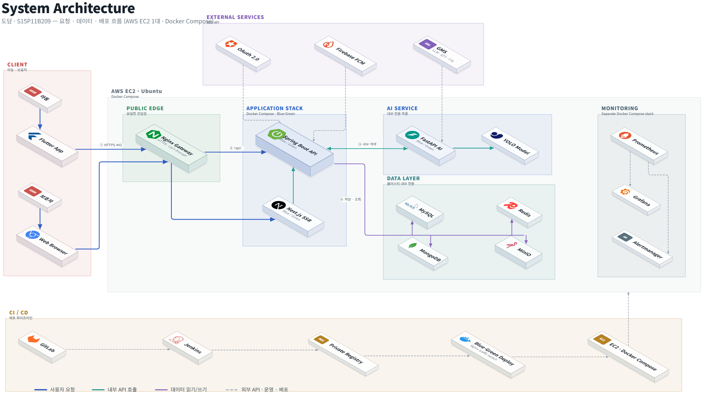
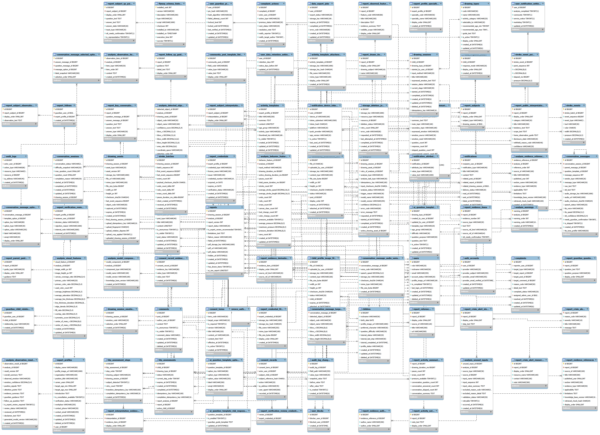

## 👨‍👩‍👧‍👦 팀원 소개

<div align="center">

| | | | | | |
|:-:|:-:|:-:|:-:|:-:|:-:|
| **강병구** | **이강륜** | **오민근** | **편주희** | **안윤주** | **장우창** |
| Backend · Frontend · AI | Infra · AI · Backend | Backend · Frontend | AI · Frontend | Frontend (Mobile · Web) | Frontend (Mobile · Web) |
| [@byegu](https://github.com/byegu) | [@KangRyun](https://github.com/KangRyun) | [@mingeunoh5312-svg](https://github.com/mingeunoh5312-svg) | [@jewjd0](https://github.com/jewjd0) | [@dbswn58](https://github.com/dbswn58) | [@JejuTangerine](https://github.com/JejuTangerine) |

<div align="center">


### 아이의 마음을 그림으로 만나요

만 4~12세 아동이 그림과 대화를 통해 생각과 감정을 표현하도록 돕고,<br/>
보호자와 전문가에게 활동 기록과 AI 관찰 리포트를 제공하는 서비스입니다.

**SSAFY 15기 공통 프로젝트**<br/>
2026.07.07 ~ 2026.08.15

</div>

---

## 📜 목차

1. [서비스 소개](#-서비스-소개)
2. [주요 기능](#-주요-기능)
3. [서비스 화면](#-서비스-화면)
4. [기술 스택](#-기술-스택)
5. [시스템 아키텍처](#-시스템-아키텍처)
6. [ERD](#-erd)
7. [기술 특이점](#-기술-특이점)
8. [산출물](#-산출물)
9. [팀원 소개](#-팀원-소개)

---

## 🎨 서비스 소개

#### 기획 배경

아동 미술치료는 그림을 통해 아이의 심리 상태를 관찰하는 효과적인 방법이지만,
전문 상담은 비용과 접근성의 한계가 있습니다.
**도담**은 AI 캐릭터와의 대화를 결합해 누구나 쉽게 아이의 정서를 살펴볼 수 있도록 기획했습니다.

#### 핵심 흐름

```
그림 그리기 → AI 캐릭터와 대화 → 감정 선택 → AI 분석 → 관찰 리포트
```

1. 아이가 캔버스에 그림을 그리거나, 종이 그림을 촬영합니다
2. AI 캐릭터(도다미)가 그림을 보며 음성·선택 칩으로 대화합니다
3. 활동 종료 시 아이가 감정을 선택하면 백그라운드 분석이 시작됩니다
4. 보호자에게 그림·대화·과정 데이터를 종합한 **관찰 리포트**를 제공합니다

> ⚠️ AI 결과물은 **진단이 아닌 관찰 참고 자료**입니다. 전문가 연결로 이어지는 보조 도구입니다.

#### 대상 사용자

| 역할 | 설명 |
|------|------|
| **보호자** | 아이 등록, 활동 시작, 관찰 리포트 열람, 커뮤니티 |
| **아동** | 전체화면 아동 모드에서 그리기·대화 활동 |
| **전문가** | 자격 인증 후 Q&A 답변, 미술 자료 등록 |
| **관리자** | 대시보드, 사용자·콘텐츠 관리, 전문가 심사 |

---

## ✨ 주요 기능

| 기능 | 설명 |
|------|------|
| **소셜 로그인** | 카카오·구글·네이버·애플 OAuth + JWT 인증 |
| **아동 모드** | 전체화면·가로모드·큰 버튼, 길게 눌러 잠금 해제 |
| **캔버스 그리기** | 획·색·시간 과정 데이터 수집, 자동 저장, 오프라인 유지 |
| **종이 그림 촬영** | 카메라/갤러리 업로드, 기울기·밝기 자동 보정 |
| **AI 캐릭터 대화** | GPT 기반 질문 생성, 음성(STT/TTS) + 선택 칩 답변 |
| **그림 심리 검사** | HTP(집-나무-사람), 자유화·그림일기 지원 |
| **관찰 리포트** | 그림·대화·과정 종합 분석, 근거·확신도 표기, PDF 다운로드 |
| **위험 신호 감지** | 감지 시 보호자에게만 안내 (아동 화면 비노출) |
| **커뮤니티 (웹)** | 게시판(보호자 이야기/칼럼/전문가 Q&A/공지) |

---

## 🎬 서비스 화면

<!-- 
  TODO: 기능별 GIF/스크린샷을 docs/readme/ 에 넣고 아래 경로를 채워주세요.
  권장 크기: GIF 600px 폭, 스크린샷 300px 폭
  파일명 예시: 01_login.gif, 02_child_mode.gif, ...
-->

### 보호자 온보딩

| 소셜 로그인 | 아동 등록 | 보호자 홈 |
|:-:|:-:|:-:|
|  |  |  |

### 아동 활동 (핵심)

| 캔버스 그리기 | AI 캐릭터 대화 | 감정 선택 |
|:-:|:-:|:-:|
|  |  |  |

### 관찰 리포트

| 리포트 열람 | PDF 다운로드 |
|:-:|:-:|
|  |  |

### 커뮤니티 (웹)

| 게시판 | 글 작성 |
|:-:|:-:|
|  |  |

---

## 🛠 기술 스택

### Frontend


### Backend


### AI


### Database


### Infra / CI·CD


### 협업


---

## 🏛 시스템 아키텍처

<!-- TODO: 아키텍처 다이어그램 이미지를 docs/readme/architecture.png 에 넣어주세요 -->



<details>
<summary>아키텍처 요약</summary>

```
┌─────────────┐  ┌─────────────┐
│ Flutter App  │  │  Next.js Web │
│  (모바일/앱)  │  │ (커뮤니티/관리)│
└──────┬───────┘  └──────┬───────┘
       │    /api/v1/**    │
       └────────┬─────────┘
          ┌─────┴──────┐
          │ Spring Boot │──── Redis (토큰·캐시)
          │  (Backend)  │──── MySQL (관계형)
          └─────┬───────┘──── MongoDB (스트로크·로그)
       /internal/v1/**  │──── MinIO (이미지·음성)
          ┌─────┴──────┐
          │   FastAPI   │──── GMS (OpenAI 호환)
          │  (AI 서버)   │     ├ LLM (대화·리포트)
          └─────────────┘     ├ STT (음성 인식)
                              └ TTS (음성 합성)
```

- Flutter 앱과 Next.js 웹은 Spring Boot `/api/v1/**`만 호출
- Spring Boot만 FastAPI `/internal/v1/**` 내부 API 호출
- Docker Compose + Nginx Blue-Green 무중단 배포, Jenkins CI/CD

</details>

---

## 🗄 ERD

<!-- TODO: ERD 이미지를 docs/readme/erd.png 에 넣어주세요 -->



---

## 💡 기술 특이점

<details>
<summary><b>1. AI 관찰 리포트 — 근거 기반 해석 파이프라인</b></summary>

- 그림 이미지 분석(VLM) + 아동 발화(STT) + 대화 맥락(LLM)을 종합해 관찰 리포트 생성
- 모든 해석 문장에 **근거(그림·발화·행동)와 확신도(강/중/약)**를 의무 부여
- 근거 없는 해석은 생성 단계에서 차단, 2-pass 자체검토로 표현 강도 검증
- HTP 문헌 메타분석 기반으로 유효 축(발화·발달 단계·주제 간 상대 차이)만 사용

</details>

<details>
<summary><b>2. 음성 대화 — STT/TTS 실시간 연동</b></summary>

- 아동 음성 답변 → Whisper STT → 텍스트화 → GPT 기반 후속 질문 생성 → TTS 음성 재생
- STT 비동기 처리 + 실패 자동 회수(Recovery) 메커니즘
- 연령별 난이도 조절(유아형/초등형), 위기 발화 감지 시 안전 응답 분기

</details>

<details>
<summary><b>3. 캔버스 과정 데이터 수집</b></summary>

- 획·색·좌표·시간을 정규화(0~1)하여 stroke-batch 단위로 수집
- MongoDB에 배치=문서 구조로 저장, TTL 자동 정리
- 오프라인에서도 그리기 유지, 복귀 시 자동 재전송

</details>

<details>
<summary><b>4. Blue-Green 무중단 배포</b></summary>

- Backend·AI·Web 3계층 모두 Blue/Green 이중 컨테이너 구성
- Nginx upstream 전환으로 다운타임 0 배포
- Jenkins 파이프라인에서 빌드 → 이미지 푸시 → 헬스체크 → 트래픽 전환 자동화

</details>

<details>
<summary><b>5. 아동 데이터 보호 설계</b></summary>

- OAuth + JWT(Access/Refresh Rotation) 인증, Redis fail-closed
- 파일 저장: MinIO S3 호환, 내부 일회성 토큰으로 AI 서버에 이미지 전달
- 푸시 디바이스 토큰 AES-256-GCM 봉인 저장
- 동의 버전·일시 기록, 탈퇴 시 아동 데이터 함께 삭제

</details>

---

## 📁 산출물

| 산출물 | 링크 |
|--------|------|
| 포팅 매뉴얼 | [`exec/포팅매뉴얼.md`](exec/포팅매뉴얼.md) |
| 시연 시나리오 | [`exec/시연시나리오.md`](exec/시연시나리오.md) |
| 외부 서비스 | [`exec/외부서비스.md`](exec/외부서비스.md) |
| DB Dump | [`exec/db/dodam-schema-and-master.sql`](exec/db/dodam-schema-and-master.sql) |
| API 명세서 | <!-- TODO: Notion 링크 --> |
| 화면 설계서 | <!-- TODO: Figma 링크 --> |
| 시연 영상 | <!-- TODO: YouTube 링크 --> |
| 발표 자료 | <!-- TODO: 링크 --> |

---
</div>

---

<div align="center">


**도담** — 아이의 마음을 그림으로 만나요

</div>
